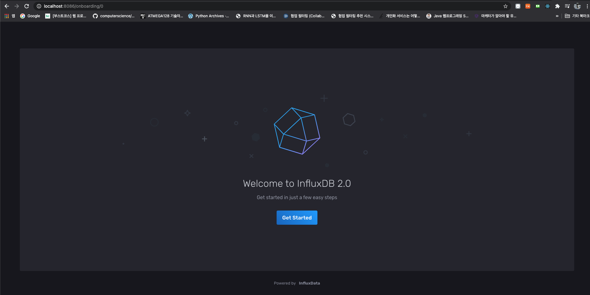
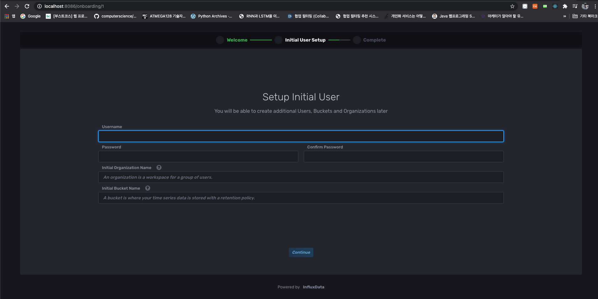
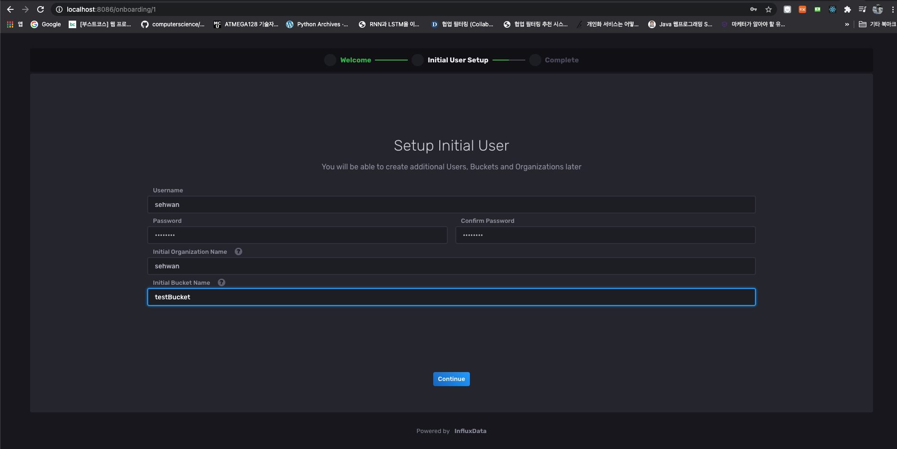
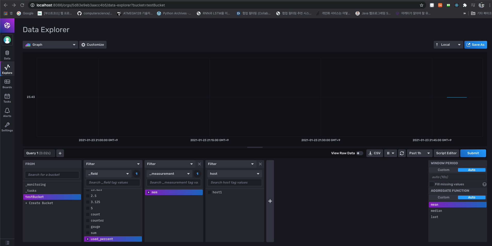

# TSDB (Time Series DataBase) 중 하나인 influx db

## 이 레포의 구조

- docs : 공식 문서를 번역하고, 개인적으로 확인한 내용들을 추가합니다.
- images : md파일에 들어갈 이미지들을 저장합니다.
- src : 파이썬을 활용한 influxdb 사용하는 예제 코드를 작성합니다.
- requiremnets.txt : influxdb와 연동하기 위한 DB connector 오픈소스 패키지를 명시헤놨습니다.
- README.md : 기초적인 설치방법 및 간단한 파이썬 예제를 작성했습니다.

## 설치법

### in MacOS without Docker

- UI 있는 버전

https://dl.influxdata.com/influxdb/releases/influxdb2-2.0.3_darwin_amd64.tar.gz
이 링크를 클릭해 다운로드
```
tar zxvf influxdb2-2.0.3_darwin_amd64.tar.gz
```

- 압축 해제 이후 influx와 influxd를 특정 경로로 보내주어야 한다.
- `sudo cp influxdb2-2.0.3_darwin_amd64/{influx,influxd} /usr/local/bin/`

- 저 경로로 보내주면 mac 터미널에서 influx, influxd 와 같은 경로를 명시하지 않고도 두 바이너리 실행 가능하다~!


### Install With Docker

- `docker run --name influxdb -p 8086:8086 quay.io/influxdb/influxdb:v2.0.3`
- 마지막 태그를 자신이 원하는 버전으로 사용하면 됨.
- influex 컨테이너 안으로 들어가기 위해서는
- `docker exec -it influxdb /bin/bash`


## 초기 설정!! 



- 최초 진입 화면(`localhost:8086`)



- UI 기반으로 최초 설정을 진행 할 수 있다.
- CLI 기반으로도 설정 가능!

- 최초 설정은 다음과 같은 것들을 설정하는 것임
    - 디폴트 조직
    - 디폴트 유저
    - 디폴트 버킷
    - 관리자 인증 토큰

- 최초 설정을 하면서 만들어진 관리자 토큰 (Admin token)은 해당 인플럭스DB의 모든 조직에 대해서 모든 읽기, 쓰기 권한을 갖고있다.
- 따라서 조직간 충돌을 방지하기 위해서 각 조직마다 All Access Token을 생성하여 각 조직별 관리자 토큰을 생성하는 것을 권장함!
- 추후 작성하기로 하며 개발 단계에서는 패스



- 최초 셋업 설정

## 초기 설정 이후 python3 와 커넥션 맺기

- 다음 패키지를 설치해야 함
    - `pip install influxdb-client`

- 클라이언트 객체를 초기화 해야 함

```python3
from datetime import datetime

from influxdb_client import InfluxDBClient, Point, WritePrecision
from influxdb_client.client.write_api import SYNCHRONOUS

# You can generate a Token from the "Tokens Tab" in the UI
token = "s7osywpu7TghUKAMs9k1HYZkHsKgUG6YkvxFdGjGSsgMLEVl0TvxqvLByAeyQiY_1tT1UdjfPf1TxZbHFs6gUg=="
org = "sehwan"
bucket = "testBucket"

client = InfluxDBClient(url="http://localhost:8086", token=token)
```

- 토큰은 자신의 조직에 대해서 발급 받을 수 있다. 위 코드로 client 객체를 초기화 함. (설정이라고 생각하면 됨)


- 기존에 존재하는 Line 프로토콜을 이용해서 데이터 쌓기

```python3
write_api = client.write_api(write_options=SYNCHRONOUS)

data = "mem,host=host1 used_percent=23.43234543"
write_api.write(bucket, org, data)
```

- 데이터 포인트를 이용해 데이터를 쌓기

```python3
point = Point("mem")\\
  .tag("host", "host1")\\
  .field("used_percent", 23.43234543)\\
  .time(datetime.utcnow(), WritePrecision.NS)

write_api.write(bucket, org, point)
```


- 일괄처리 시퀀스를 이용해 데이터 쌓기

```python3
sequence = ["mem,host=host1 used_percent=23.43234543",
            "mem,host=host1 available_percent=15.856523"]
write_api.write(bucket, org, sequence)
```

- Flux 쿼리를 실쟁하기

```python3
query = f'from(bucket: \\"{bucket}\\") |> range(start: -1h)'
tables = client.query_api().query(query, org=org)
```

- `used_percent` 에 대한 데이터를 쌓은 것에 대한 결과



