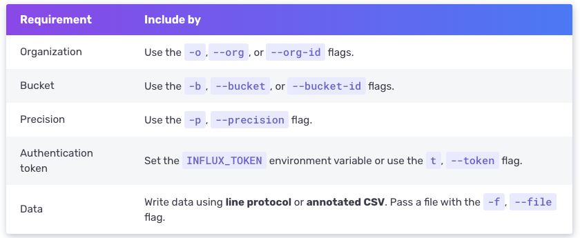

# Influx CLI를 활용하여 데이터 쓰기

커맨드 라인을 통해서 데이터 쓰기 작업을 하기 위해서는 `influx write` 명령어를 이용하면 됩니다.  
명령어는 다음과 같은 인자들을 포함해야 합니다.



## influx write 명령어 예제

- line protocol의 한개 line을 작성하기.

```console
influx write \
  -b bucketName \
  -o orgName \
  -p s \
  'myMeasurement,host=myHost testField="testData" 1556896326'
```

- 파일로부터 line protocol을 작성하기.

```console
influx write \
  -b bucketName \
  -o orgName \
  -p s \
  --format=lp
  -f /path/to/line-protocol.txt

```

- annotated CSV파일을 통해 데이터를 쓰기

```console
influx write \
  -b bucketName \
  -o orgName \
  -p s \
  --format=csv
  -f /path/to/data.csv
```