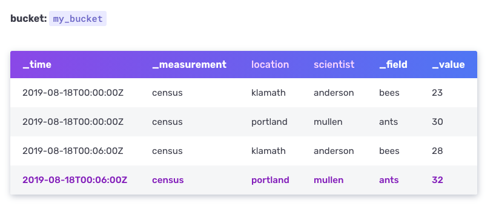
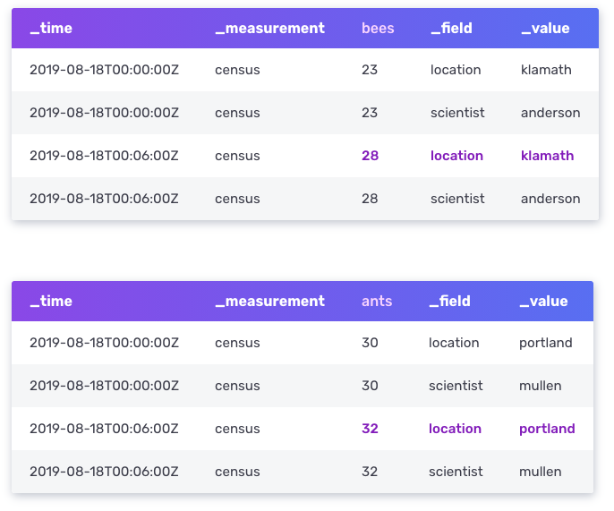
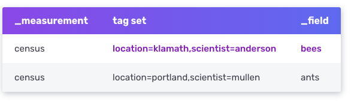

# 인플럭스 DB의 데이터 요소들

## InfluxDB 2.0은 다음과 같은 데이터 요소들을 포함합니다.

- timestamp
- field key
- field value
- field set
- tag key
- tag value
- tag set
- measurement
- series
- point
- bucket
- organization

다음 예제 데이터는 데이터 요소의 개념을 보여줍니다.



- _time은 `timestamp` 입니다.
- _measurement는 `measurement`입니다.
- location과 scientist는 `tag key` 입니다

## Timestamp

인플럭스 DB가 저장하는 모든 데이터는 타임스탬프를 저장하는 `_time` 컬럼을 갖고있습니다.  
실제 물리적 장치에 타임스탬프는 `epoch nanosecond` 포맷으로 타임스탬프가 저장됩니다.  
InfluxDB는 타임스탬프를 실제 Datetime 포맷인 `RFC3339` UTC로 데이터를 변환합니다.
데이터를 저장할 때 시간 정밀도를 신경써야 합니다.

## Measurement

위 `_measurement`컬럼은 `개체수(census)`라는 측정치의 이름을 나타내는 칼럼입니다.
측정치의 이름은 문자열입니다. measurement는 태그와 필드와 타임스탬프의 컨테이너로서 사용됩니다.
measurement는 데이터를 표현하는데 사용하면 됩니다. 예를들어 위의 `census`라는 이름은 `bees`와 `ants`의 숫자를 field values에 저장했다고 알려줍니다.

## Fields

하나의 field는 `_field`라는 칼럼에 저장된 field key와 `_value` 칼럼에 저장된 필드의 값을 포함합니다.

### Field key

field key는 해당 필드의 이름을 나타내는 문자열입니다. 위 데이터에서는 `bees`와 `ants`가 field key 입니다.

### Field value

field value는 관련된 필드에 해당하는 값을 나타냅니다. field value는 문자열, 실수형, 정수형, 불리언형이 될 수있습니다.  
위 데이터에서의 field value는 `bees` 의 개체수를 특정 시간대에 나타낸 `23`, `28`  
그리고 `ants`의 개체수를 특정 시간대에 나타낸 `30`과 `32`입니다.

### Field set
field set은 field key-value 쌍을 특정 타임스탬프와 조합한 집합입니다. 예시 데이터는 다음과 같은 field set을 포함하는거죠

```console
census bees=23i,ants=30i 1566086400000000000
census bees=28i,ants=32i 1566086760000000000
       -----------------
           Field set
```

> Field들은 인덱싱 되지 않습니다 : Field들은 InfluxDBd에서 무조건 필요한 데이터이지만, 인덱싱 되지는 않습니다.
> field value를 필터하는 쿼리는 쿼리 조건에 맞는 모든 field의 value를 스캔합니다.
> 결과적으로 tag들에 대해 쿼리하는 것이 field에 대해 쿼리하는 것보다 성능면으로 우월합니다.
> <strong>tag에 자주 쿼리되는 메타데이터를 저장할것을 추천한다!</strong>


## Tags
예제 데이터에서의 `location`과 `scientist` 칼럼이 tags입니다. Tags는 tag key들과 tag value들을 문자열과 메타데이터로서 갖고있습니다.

### Tag key
예제 데이터에서의 `location`과 `scientist`가 Tag key입니다. Tag key 필요조건에 대한 더 자세한 내용은 `Line protocol - Tag set`을 참조하세요 (추후 번역 예정)

### Tag value
`location`이라는 tag key는 총 2개의 `klamath`와 `portland`라는 tag value들을 갖습니다.   
`scientist`라는 tag key는 총 `anderson` 과 `mullen`이라는 두개의 tag value들을 갖습니다. 자세한 내용은 `Line protocl - Tag set`을 참조하세요

### Tag set
태그 키 : 값 쌍의 집합을 Tag set이라고 합니다. 예제 데이터는 다음과 같은 태그 셋을 갖습니다.

```text
location = klamath, scientist = anderson
location = portland, scientist = anderson
location = klamath, scientist = mullen
location = portland, scientist = mullen
```

> 태그들은 인덱싱 되었습니다: 태그는 옵션이라서, 무조건 여러분의 데이터 구조에 넣을 필요는 없습니다. 하지만 tag를 포함하는건 떄때로 매우 좋은 데이터에 대한 접근법이 됩니다.  
> 태그들은 인덱싱 되었기 때문에 태그에 대해서 쿼리하믄 것은 필드에 대해 쿼리하는 것 보다 훨씬 빠릅니다. 
> 따라서 자주 쿼리되는 데이터에 대해 태그를 이용해 메타데이터를 설정하는것은 좋은 아이디어입니다.

> 태그에 매우 겹치지 않고 변화가 클만한 데이터. 그러니까 UUID나, 해쉬, 랜덤 문자열을 저장하는것은 좋은 아이디어가 아닙니다.
> 데이터베이스가 더 많은 메모리를 쓰게 만듭니다.


## 예제 스키마의 문제점

fields에 있는 value에 대해서 대부분의 쿼리가 작성된다면. 문제가 된다. 예를들어 23마리의 `bees`를 찾는 쿼리를 보낸다고 하면

```console
from(bucket: "bucket-name")
  |> range(start: 2019-08-17T00:00:00Z, stop: 2019-08-19T00:00:00Z)
  |> filter(fn: (r) => r._field == "bees" and r._value == 23)
```

- 위 쿼리에서 InfluxDB는 응답을 리턴하기 전까지 데이터 셋에서 모든 field의 값을 스캔하게 된다.
- 만약 `census`데이터가 수백만개의 레코드로 구성이된다면 매우 끔찍할것이다.
- 따라서 스키마를 재조정해서 fields (`bees`와 `ants`를)를 tags로 바꾸고, tags(`location`와 `scientist`)가 fields로 바꾸자.



`bees`와 `ants`가 태그가 되어서 더이상 모든 `_field`와 `_value`를 스캔할 필요가 없어졌다. 이로써 쿼리 속도 상승

## Series
Series key는 measurement와 tag set과 field key를 공유하는 포인트의 집합이다.
예제 데이터에서의 경우에는 2개의 유니크한 series key들이 존재한다.



Series는 주어진 특정한 series key에 대한 timestamp와 field value를 의미한다.

밑에 Series key와 Series의 상관 관계를 볼 수 있다.

```console
# series key
census,location=klamath,scientist=anderson bees

# series
2019-08-18T00:00:00Z 23
2019-08-18T00:06:00Z 28       
```

series에 대한 컨셉을 이해하는것은 스키마를 설계하고 influx db를 효율적으로 사용하는데 매우 중요한 요소다.

## Point

point는 series key와 field value와 timestamp를 포함한다. 예를들어 샘플 데이터의 어떤 하나의 point는 다음과 같다.

```console
2019-08-18T00:00:00Z census ants 30 portland mullen
```

## Bucket

모든 InfluxDB의 데이터는 버킷에 저장된다. 버킷은 데이터베이스와 retention 주기 (삭제 주기)를 합친 개념이다.  
버킷은 하나의 조직에 속한다.

## Organization

조직은 어떤 하나의 유저들의 그룹의 작업공간이다. 모든 대시보드, task, 버킷, 유저는 조직에 속한다.