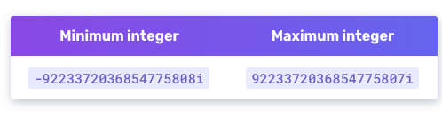
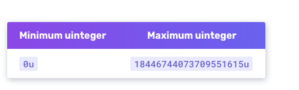
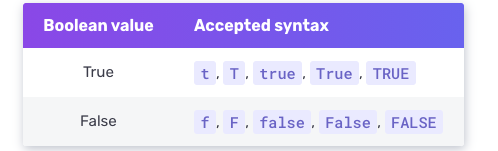
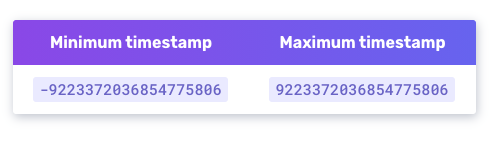
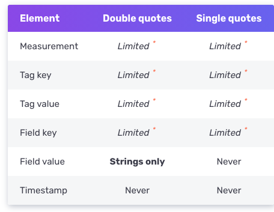

# Line Protocol

InfluxDB는 데이터 포인트들을 쓰기 위해서 line protocol을 이용합니다. 하나의 데이터 포인트의 measurement, tag, set, field set, timestamp등을 텍스트 기반의 포멧으로 제공하는 방법입니다.

```console
// Syntax
<measurement>[,<tag_key>=<tag_value>[,<tag_key>=<tag_value>]] <field_key>=<field_value>[,<field_key>=<field_value>] [<timestamp>]

// Example
myMeasurement,tag1=value1,tag2=value2 fieldKey="fieldValue" 1556813561098000000
```

개행문자 `\n`로 분리된 라인은 각각의 포인트를 의미합니다. 또한 Line protocol은 공백에 민감합니다. 주의하세요.

> 라인 프로토콜은 개행문자 `\n`를 태그나, 필드 값들에 대해서 지원하지 않습니다.

## Line protocol의 요소들

```console
measurementName,tagKey=tagValue fieldKey="fieldValue" 1465839830100400200
--------------- --------------- --------------------- -------------------
       |               |                  |                    |
  Measurement       Tag set           Field set            Timestamp
```

### Measurement
(필수인자) Measurement의 이름을 의미합니다. InfluxDB는 하나의 데이터 포인트에 대해서 하나의 measurement를 허용합니다.
Measurement의 이름은 대소문자에 민감하며(case-sensitive), 네이밍 규칙에 따라서 작성되어야 합니다.

<strong> 데이터 타입 : 문자열 </strong>

### Tag set

(옵션) 하나의 포인트에 대한 모든 태그 키-값 쌍을 의미합니다. 키-값쌍의 관계는 `=` 연산자를 통해 관계맺어집니다.
여러 태그 키-값쌍은 콤마로 구분됩니다. 태그 키들과 태그 값들은 대소문자에 민감합니다(case-sensitive). 태그 키들은 네이밍 규칙에 따라 작성되어야 합니다.

<strong>키 데이터 타입 : 문자열 </strong>
<strong>값 데이터 타입 : 문자열 </strong>

### Field Set
(필수인자)하나의 포인트에 대한 모든 필드의 키-값쌍입니다. 포인트는 적어도 하나의 필드를 가져야 합니다. 필드 키와 문자열 값들은 모두 대소문자에 민감합니다(case-sensitive). 필드 키들은 네이밍 규칙에 따라서 작성되어야 합니다.

<strong>키 데이터 타입 : 문자열 </strong>
<strong>값 데이터 타입 : Float | Integer | UInteger | String | Boolean </strong>

> 필드 값에 문자열을 넣을 경우 무조건 `"` 즉 double quote을 사용해야 합니다.

```console
measurementName fieldKey="field string value" 1556813561098000000
```

### Timestamp
(옵션) 데이터 포인트에 대한 유닉스 타임 스탬프를 의미합니다. InfluxDB는 포인트 하나에 하나의 타임스탬프를 허용합니다. 만약 타임스탬프 값이 제공되지 않는다면 InfluxDB가 호스트 머신의 UTC(시스템 시간)을 이용해 타임스탬프를 찍습니다. 

<strong> 데이터 타입 : 유닉스 타임스탬프 </strong>

> ### 타임 스탬프관련 중요사항
> - 만약 데이터가 `수집된` 시간을 보장하기 위해서는 타임스탬프를 InlfuxDB가 찍게하지 마시고, 타임스탬프를 찍어서 InfluxDB에 넣으세요.
> - 만약 타임스탬프에 나노초가 없다면. 데이터 쓰기 작업을 할 때 타임스탬프의 정밀도(precision)를 명시해야 합니다.

### Whitespace

라인 프로콜에서의 공백은 데이터 포인트를 해석하는데 사용됩니다. 첫번째 이스케이핑 되지 않은 공백(`\`이 안들어간)은 첫번째 field set에 대해서 measurement와 tag set을 구분합니다. 두번째 이스케이핑 되지 않은 공백은 필드 셋으로부터 타임스탬프를 구분합니다.

```console
measurementName,tagKey=tagValue fieldKey="fieldValue" 1465839830100400200
                               |                     |
                           1st space             2nd space
```                        

## 데이터 타입과 포맷

### Float
IEEE-754 규격에 맞는 64-bit 부동 소수점 데이터입니다. 숫자형 데이터의 디폴트 타입이며, InfluxDB는 과학적 표기법을 지원합니다.

<strong> Float 필드 값 예제 </strong>

```console
myMeasurement fieldKey=1.0
myMeasurement fieldKey=1
myMeasurement fieldKey=-1.234456e+78
```

### Integer
부호있는 64bits 정수형 데이터입니다. 데이터의 맨 끝의 i가 이 값이 정수형 데이터라는것을 명시합니다.



<strong> Integer 필드 값 예제 </strong>

```console
myMeasurement fieldKey=1i
myMeasurement fieldKey=12485903i
myMeasurement fieldKey=-12485903i
```

### UInteger
부호 없는 64bits 정수형 데이터입니다. 데이터의 맨 끝 u가 이 데이터가 부호없는 정수형이라는것을 명시합니다.



<strong> UInteger 필드 값 예제 </strong>

```console
myMeasurement fieldKey=1u
myMeasurement fieldKey=12485903u
```

### Strinig
순수한 텍스트 문자열입니다. 길이 최대치는 64KB입니다.

<strong> String 필드 값 예제 </strong>

```console
# String measurement name, field key, and field value
myMeasurement fieldKey="this is a string"
```

### Boolean
`true` 혹은 `false` 값을 저장합니다.



<strong> Boolean 필드 값 예제 </strong>

```console
myMeasurement fieldKey=true
myMeasurement fieldKey=false
myMeasurement fieldKey=t
myMeasurement fieldKey=f
myMeasurement fieldKey=TRUE
myMeasurement fieldKey=FALSE
```

> 불리언 필드 값에 절대로 `"`을 사용하지 마세요. 그렇게하면 InfluxDB는 문자열로 인식할거에요 :(

### UNIX timestamp
정밀도가 명시된 유닉스 타임스탬프 값입니다. 디폴트 정밀도는 nanosecond (ns)에요.



<strong> Unix timestamp 값 예제 </strong>

```console
myMeasurementName fieldKey="fieldValue" 1556813561098000000
```

### Quotes (인용문자, 큰따옴표, 작은따옴표)
라인 프로토콜은 큰따옴표와 작은따옴표 둘다 지원해요.



라인 프로토콜은 measurement 의 이름과, 태그 키, 태그 값 그리고 필드 값들에 대해서 큰따옴표 (`"`)와 작은따옴표 (`'`) 둘다 지원해요.
하지만 그것들을 이름, 키, 값들의 부분으로 해석할거에요.

### 네이밍 규칙
Measurement의 이름과, 태그 키들, 그리고 필드 값들은 절대로 `_` 이 언더스코어로 시작 할 수 없어요. `_`의 네임스페이스는 InfluxDB의 내부 시스템이 예약하고 있거든여.

